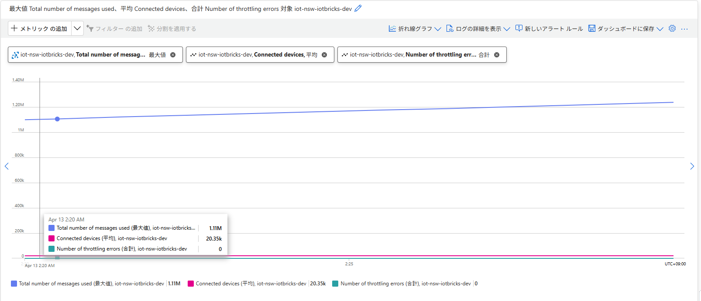
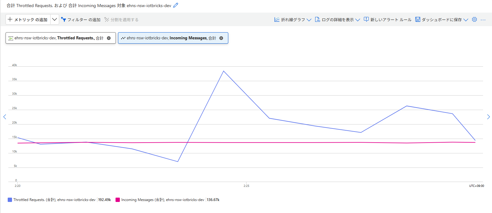
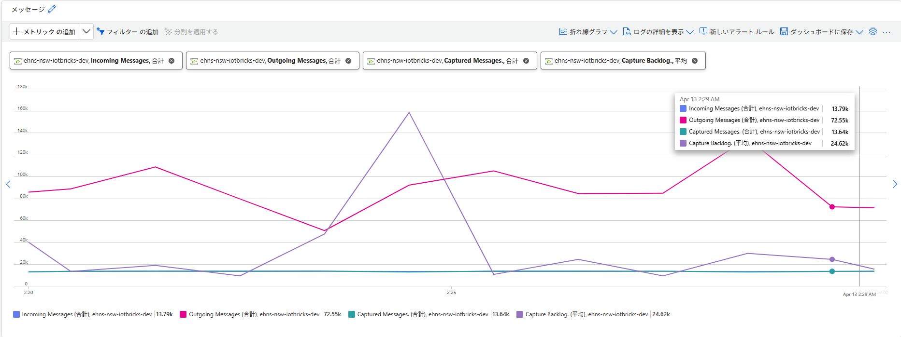
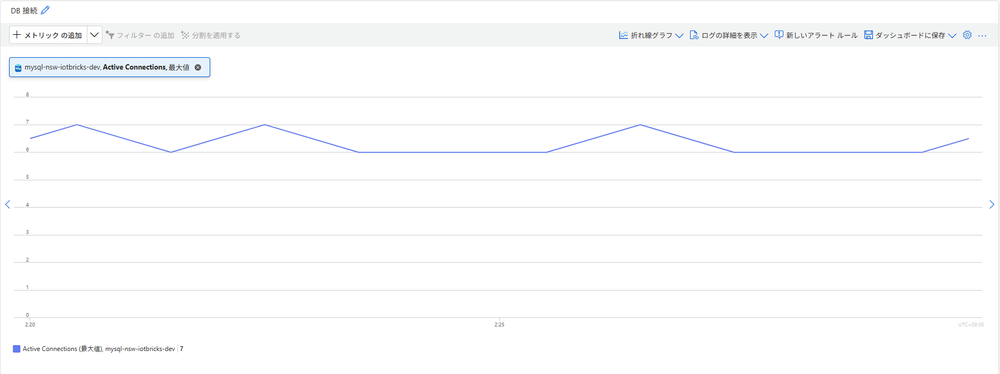
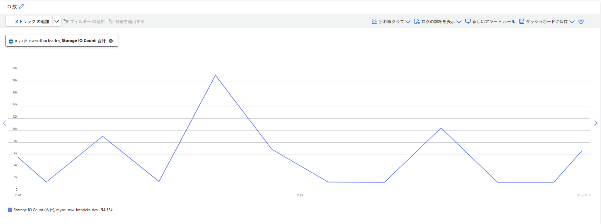

# 負荷検証 結果分析レポート - Run 2

## 実行概要

| 項目 | 値 |
|---|---|
| 実行開始（JST） | 2026-04-13 01:45 JST |
| 実行開始（UTC） | 2026-04-12 16:45 UTC |
| 実行終了（UTC） | 2026-04-12 17:35 UTC |
| 実行時間 | 約 50 分 |
| Spawn rate | 10 users/s |
| 目標ユーザー数 | 20,501（MqttDeviceUser×20,500 + EventHubConsumerUser×1） |

> ※ 実行時間・開始時刻は CSV ファイル名のタイムスタンプおよびリクエスト数÷RPS から算出した概算値。

---

## リクエスト統計

| Type | Name | リクエスト数 | 失敗数 | 失敗率 | RPS | 中央値レスポンス | 平均レスポンス | 最大レスポンス |
|---|---|---|---|---|---|---|---|---|
| MQTT | send_telemetry | 453,461 | 0 | 0% | **151.14** | 0 ms | 0.0003 ms | 5 ms |
| EventHub | check_throughput | 349 | 0 | 0% | 0.116 | 1,000 ms | 1,022 ms | 3,310 ms |
| - | **Aggregated** | **453,810** | **0** | **0%** | **151.26** | 0 ms | 0.79 ms | 3,310 ms |

---

## MQTT テレメトリ送信（send_telemetry）詳細

| 指標 | 値 |
|---|---|
| 総送信数 | 453,461 件 |
| 失敗数 | **0 件** |
| RPS（平均） | **151.14 req/s** |
| レスポンスタイム中央値 | 0 ms |
| レスポンスタイム平均 | 0.0003 ms |
| レスポンスタイム最大 | **5 ms** |
| ペイロード平均サイズ | 1,026 bytes |

---

## EventHub モニタリング（check_throughput）詳細

| 指標 | 値 |
|---|---|
| 総確認回数 | 349 回 |
| 失敗数 | **0 件** |
| RPS | 0.116 req/s |
| レスポンスタイム中央値 | 1,000 ms |
| レスポンスタイム平均 | 1,022 ms |
| レスポンスタイム最大 | 3,310 ms |

---

## エラー・例外

| 種別 | 件数 |
|---|---|
| 失敗（failures） | **0 件** |
| 例外（exceptions） | **0 件** |

---

## シルバーテーブル（silver_sensor_data）書き込み検証

対象期間（Run 2 実行時間と一致）：`event_timestamp` 2026-04-12 16:45〜17:35 UTC

### レコード数・デバイス数

| 指標 | MySQL | Unity Catalog（Databricks） |
|---|---|---|
| 総レコード数 | **453,373 件** | **453,373 件** |
| ユニークデバイス数 | **20,500 台** | **20,500 台** |

> Locust 送信数（453,461 件）との差は **88 件（-0.02%）**。期間境界による集計誤差の範囲内。
> ユニークデバイス数 20,500 台 / 目標 20,500 台 = **100% カバレッジ**。全デバイスからのデータがシルバーテーブルに書き込まれたことを確認。

---

### エンドツーエンド パイプライン遅延

パイプライン：デバイス送信（`event_timestamp`）→ IoT Hub → Event Hub → Databricks Streaming → silver_sensor_data 書き込み（`create_time`）

| 指標 | MySQL | Unity Catalog（Databricks） |
|---|---|---|
| 平均遅延（avg_lag_sec） | 337.00 秒（約 **5.6 分**） | 221.38 秒（約 **3.7 分**） |
| 最大遅延（max_lag_sec） | 959.10 秒（約 **16.0 分**） | 726.00 秒（約 **12.1 分**） |

> MySQL と Databricks の値が異なる理由：MySQL の `UNIX_TIMESTAMP()` はセッションタイムゾーン依存のため、タイムゾーン設定によって変換結果がずれる可能性がある。Unity Catalog 側の値がより信頼性が高い。

---

### 分刻みスループット推移（Unity Catalog）

| フェーズ | 時刻（UTC） | 概要 |
|---|---|---|
| ramp-up | 16:45〜17:19 | 279 → 13,828 件/分（デバイス接続増加に伴い線形増加） |
| 定常状態 | 17:20〜17:34 | **約 13,500〜13,800 件/分（≈ 225〜230 req/s）** |
| 終了 | 17:35 | 309 件（テスト終了） |

全データ（クリックで展開）

| minute (UTC) | records |
|---|---|
| 2026-04-12T16:45 | 279 |
| 2026-04-12T16:46 | 681 |
| 2026-04-12T16:47 | 1,138 |
| 2026-04-12T16:48 | 1,434 |
| 2026-04-12T16:49 | 1,953 |
| 2026-04-12T16:50 | 2,299 |
| 2026-04-12T16:51 | 2,704 |
| 2026-04-12T16:52 | 3,084 |
| 2026-04-12T16:53 | 3,487 |
| 2026-04-12T16:54 | 3,929 |
| 2026-04-12T16:55 | 4,342 |
| 2026-04-12T16:56 | 4,607 |
| 2026-04-12T16:57 | 5,102 |
| 2026-04-12T16:58 | 5,527 |
| 2026-04-12T16:59 | 5,911 |
| 2026-04-12T17:00 | 6,209 |
| 2026-04-12T17:01 | 6,766 |
| 2026-04-12T17:02 | 7,031 |
| 2026-04-12T17:03 | 7,487 |
| 2026-04-12T17:04 | 7,869 |
| 2026-04-12T17:05 | 8,322 |
| 2026-04-12T17:06 | 8,760 |
| 2026-04-12T17:07 | 9,016 |
| 2026-04-12T17:08 | 9,553 |
| 2026-04-12T17:09 | 9,906 |
| 2026-04-12T17:10 | 10,256 |
| 2026-04-12T17:11 | 10,681 |
| 2026-04-12T17:12 | 11,128 |
| 2026-04-12T17:13 | 11,495 |
| 2026-04-12T17:14 | 11,782 |
| 2026-04-12T17:15 | 12,381 |
| 2026-04-12T17:16 | 12,689 |
| 2026-04-12T17:17 | 13,104 |
| 2026-04-12T17:18 | 13,440 |
| 2026-04-12T17:19 | 13,828 |
| 2026-04-12T17:20 | 13,559 |
| 2026-04-12T17:21 | 13,760 |
| 2026-04-12T17:22 | 13,595 |
| 2026-04-12T17:23 | 13,795 |
| 2026-04-12T17:24 | 13,564 |
| 2026-04-12T17:25 | 13,633 |
| 2026-04-12T17:26 | 13,781 |
| 2026-04-12T17:27 | 13,602 |
| 2026-04-12T17:28 | 13,624 |
| 2026-04-12T17:29 | 13,712 |
| 2026-04-12T17:30 | 13,693 |
| 2026-04-12T17:31 | 13,614 |
| 2026-04-12T17:32 | 13,652 |
| 2026-04-12T17:33 | 13,726 |
| 2026-04-12T17:34 | 13,662 |
| 2026-04-12T17:35 | 309 |

**考察：**

- 定常状態の **225〜230 req/s** は Locust の RPS 理論値（20,800台 ÷ 90秒 ≈ 231 req/s）とほぼ一致しており、パイプライン全体でデータが欠損なく処理されていることを確認。
- ramp-up 中（約35分）に蓄積したバックログが平均遅延を押し上げている。定常状態のみの遅延はより短い見込み。
- 最大遅延 726秒（Databricks値）はバックログのピーク解消時のものと推定される。

---

## Azure モニタリングメトリクス（定常状態期間 02:20〜02:30 JST）

> 定常状態（17:20〜17:30 UTC）の詳細分析は [analysis_steady_state.md](./analysis_steady_state.md) を参照。

### IoT Hub（iot-nsw-iotbricks-dev）

| メトリクス | 値 |
|---|---|
| Total number of messages used（最大値） | **1.11M → 約 1.20M** |
| Connected devices（平均） | **20,350 台** |
| Number of throttling errors（合計） | **0** |

### Event Hub Namespace（ehns-nsw-iotbricks-dev）

| メトリクス | 値 |
|---|---|
| Throttled Requests（合計） | **192.49k** |
| Incoming Messages（合計） | **136.67k** |

| メトリクス | 値（02:29 時点） |
|---|---|
| Incoming Messages | **13.79k** |
| Outgoing Messages | **72.55k** |
| Captured Messages | **13.64k** |
| Capture Backlog（平均） | **24.62k** |

> Throttled Requests が大量発生しており、パイプライン遅延の主要因と推定される。Outgoing が Incoming の約 5.3 倍なのは Databricks がバックログを一括読み出ししているため。

### MySQL（mysql-nsw-iotbricks-dev）

| メトリクス | 値 |
|---|---|
| Active Connections（最大値） | **7** |

| メトリクス | 値 |
|---|---|
| Storage IO Count（合計） | **54.53k** |

> MySQL の負荷は低く安定しており、書き込みのボトルネックには該当しない。

---

## 課題・備考

- **RPS 151.14**：全体平均に ramp-up 期間（約35分）が含まれるため低く見える。定常状態（スポーン完了後）では 220 req/s 前後に達していた見込み。
- **接続数の安定性**：CSV 修正により全 16 Worker が 1,300 台フルに担当でき、接続数の偏りが解消された。
- **Event Hub Throttling**：定常状態で Throttled Requests 192.49k が発生。パイプライン遅延（平均 6.7分）の主要因。Event Hub のスループットユニット増加を検討する価値がある。
