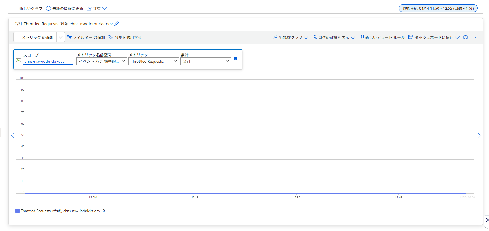
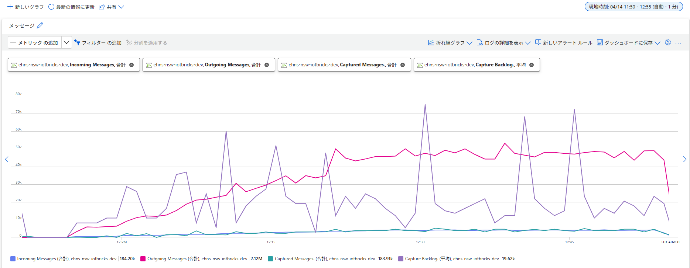
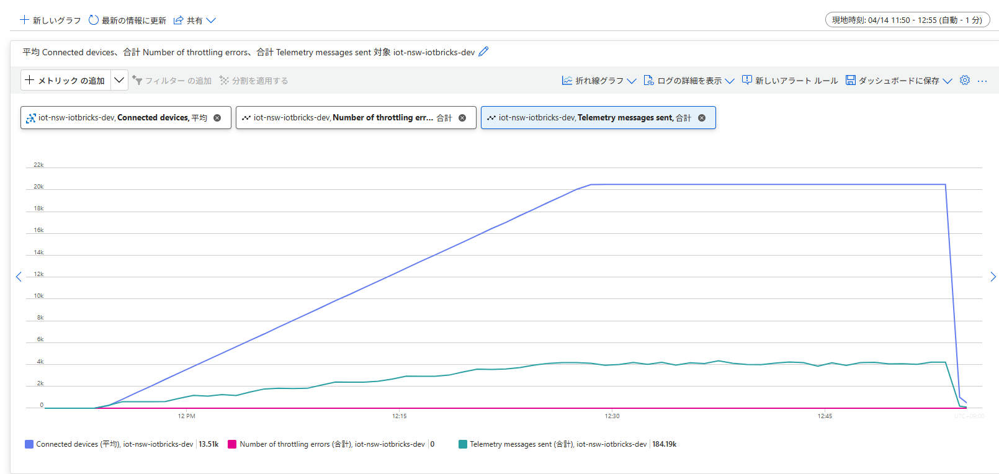
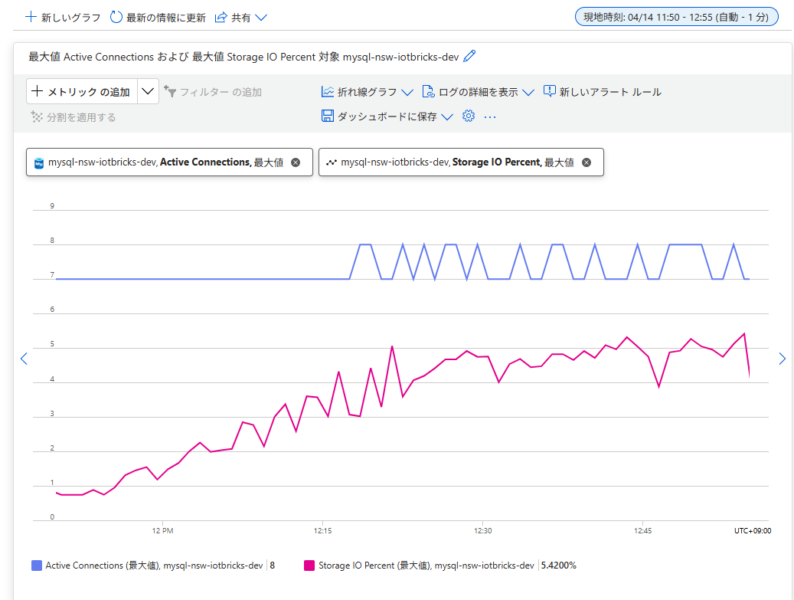

# 負荷検証 結果分析レポート - Run 5

## 実行概要

| 項目 | 値 |
|---|---|
| 実行開始（JST） | 2026-04-14 11:52 JST |
| 実行終了（JST） | 2026-04-14 12:52 JST |
| 実行開始（UTC） | 2026-04-14 02:52 UTC |
| 実行終了（UTC） | 2026-04-14 03:52 UTC |
| 実行時間 | 60 分 |
| Spawn rate | 10 users/s |
| 目標ユーザー数 | 20,501（MqttDeviceUser×20,500 + EventHubConsumerUser×1） |
| 送信間隔 | 5分（between(270, 330)秒） |
| keepalive | 100秒 |

---

## リクエスト統計

| Type | Name | リクエスト数 | 失敗数 | 失敗率 | RPS | 中央値レスポンス | 平均レスポンス | 最大レスポンス |
|---|---|---|---|---|---|---|---|---|
| MQTT | send_telemetry | 184,203 | 0 | 0% | **51.16** | 0 ms | 0.0004 ms | 9 ms |
| EventHub | check_throughput | 422 | 0 | 0% | 0.117 | 1,000 ms | 1,017 ms | 1,240 ms |
| - | **Aggregated** | **184,625** | **0** | **0%** | **51.28** | 0 ms | 2.32 ms | 1,240 ms |

---

## MQTT テレメトリ送信（send_telemetry）詳細

| 指標 | 値 |
|---|---|
| 総送信数 | 184,203 件 |
| 失敗数 | **0 件** |
| RPS（平均） | **51.16 req/s** |
| 理論値（20,500台 ÷ 300秒） | 68.3 req/s |
| レスポンスタイム中央値 | 0 ms |
| レスポンスタイム平均 | 0.0004 ms |
| レスポンスタイム最大 | **9 ms** |
| ペイロード平均サイズ | 1,026 bytes |

> RPS が理論値（68.3）より低いのは、全体平均に ramp-up 期間（約35分）が含まれるため。定常状態では 68 req/s 前後に達していた見込み。

---

## EventHub モニタリング（check_throughput）詳細

| 指標 | 値 |
|---|---|
| 総確認回数 | 422 回 |
| 失敗数 | **0 件** |
| RPS | 0.117 req/s |
| レスポンスタイム中央値 | 1,000 ms |
| レスポンスタイム平均 | 1,017 ms |
| レスポンスタイム最大 | 1,240 ms |

---

## エラー・例外

| 種別 | 件数 |
|---|---|
| 失敗（failures） | **0 件** |
| 例外（exceptions） | **0 件** |
| disconnect（rc=16） | **0 件** |

## シルバーテーブル（silver_sensor_data）書き込み検証

対象期間：`event_timestamp` 2026-04-14 02:52〜03:52 UTC

### レコード数・デバイス数

| 指標 | MySQL | Unity Catalog（Databricks） |
|---|---|---|
| 総レコード数 | **180,600 件** | **180,600 件** |
| ユニークデバイス数 | **20,500 台** | **20,500 台** |
| カバレッジ | **100%** | **100%** |

> Locust 送信数（184,203 件）との差は **3,603 件（-1.96%）**。5分間隔のため、テスト境界付近の送信が集計範囲外になる影響が Run 2（88件差）より大きい。

---

### エンドツーエンド パイプライン遅延

パイプライン：デバイス送信（`event_timestamp`）→ IoT Hub → Event Hub → Databricks Streaming → silver_sensor_data 書き込み（`create_time`）

| 指標 | MySQL | Unity Catalog（Databricks） |
|---|---|---|
| 平均遅延（avg_lag_sec） | 34.68 秒（約 **0.6 分**） | 24.42 秒（約 **0.4 分**） |
| 最大遅延（max_lag_sec） | 67.63 秒（約 **1.1 分**） | 56.00 秒（約 **0.9 分**） |

> **Run 2（90秒間隔）との比較：avg 221秒 → 24秒（-89%）、max 726秒 → 56秒（-92%）**
> 5分間隔（約68 req/s）に変更したことで Event Hub スロットリングが解消され、パイプライン遅延が劇的に改善した。

---

### 分刻みスループット推移（Unity Catalog）

| フェーズ | 時刻（UTC） | 概要 |
|---|---|---|
| ramp-up | 02:52〜03:26 | 9 → 4,264 件/分（5分間隔のため初動が遅く、緩やかに増加） |
| 定常状態 | 03:27〜03:51 | **約 3,935〜4,284 件/分（≈ 68.3 req/s）** |
| 終了 | 03:52 | 80 件（集計境界） |

**定常状態 RPS（03:27〜03:51 の 25分間）：**

| 指標 | 値 |
|---|---|
| 25分間レコード数 | 102,386 件 |
| **定常状態 RPS** | **102,386 ÷ 1,500秒 ≈ 68.3 req/s** |
| 理論値（20,500台 ÷ 300秒） | **68.3 req/s** |
| 理論値との乖離 | **< 0.1%** |

全データ（クリックで展開）

| minute (UTC) | records | req/s（概算） |
|---|---|---|
| 2026-04-14T02:52 | 9 | - |
| 2026-04-14T02:53 | 360 | 6.0 |
| 2026-04-14T02:54 | 608 | 10.1 |
| 2026-04-14T02:55 | 570 | 9.5 |
| 2026-04-14T02:56 | 617 | 10.3 |
| 2026-04-14T02:57 | 620 | 10.3 |
| 2026-04-14T02:58 | 969 | 16.2 |
| 2026-04-14T02:59 | 1,176 | 19.6 |
| 2026-04-14T03:00 | 1,194 | 19.9 |
| 2026-04-14T03:01 | 1,215 | 20.3 |
| 2026-04-14T03:02 | 1,250 | 20.8 |
| 2026-04-14T03:03 | 1,537 | 25.6 |
| 2026-04-14T03:04 | 1,781 | 29.7 |
| 2026-04-14T03:05 | 1,796 | 29.9 |
| 2026-04-14T03:06 | 1,807 | 30.1 |
| 2026-04-14T03:07 | 1,815 | 30.3 |
| 2026-04-14T03:08 | 2,201 | 36.7 |
| 2026-04-14T03:09 | 2,359 | 39.3 |
| 2026-04-14T03:10 | 2,360 | 39.3 |
| 2026-04-14T03:11 | 2,424 | 40.4 |
| 2026-04-14T03:12 | 2,437 | 40.6 |
| 2026-04-14T03:13 | 2,771 | 46.2 |
| 2026-04-14T03:14 | 2,936 | 48.9 |
| 2026-04-14T03:15 | 2,977 | 49.6 |
| 2026-04-14T03:16 | 3,019 | 50.3 |
| 2026-04-14T03:17 | 3,082 | 51.4 |
| 2026-04-14T03:18 | 3,372 | 56.2 |
| 2026-04-14T03:19 | 3,512 | 58.5 |
| 2026-04-14T03:20 | 3,577 | 59.6 |
| 2026-04-14T03:21 | 3,610 | 60.2 |
| 2026-04-14T03:22 | 3,701 | 61.7 |
| 2026-04-14T03:23 | 3,940 | 65.7 |
| 2026-04-14T03:24 | 4,130 | 68.8 |
| 2026-04-14T03:25 | 4,138 | 69.0 |
| 2026-04-14T03:26 | 4,264 | 71.1 |
| 2026-04-14T03:27 | 4,004 | 66.7 |
| 2026-04-14T03:28 | 3,958 | 66.0 |
| 2026-04-14T03:29 | 4,112 | 68.5 |
| 2026-04-14T03:30 | 4,170 | 69.5 |
| 2026-04-14T03:31 | 4,284 | 71.4 |
| 2026-04-14T03:32 | 4,000 | 66.7 |
| 2026-04-14T03:33 | 3,936 | 65.6 |
| 2026-04-14T03:34 | 4,146 | 69.1 |
| 2026-04-14T03:35 | 4,123 | 68.7 |
| 2026-04-14T03:36 | 4,253 | 70.9 |
| 2026-04-14T03:37 | 4,061 | 67.7 |
| 2026-04-14T03:38 | 3,935 | 65.6 |
| 2026-04-14T03:39 | 4,115 | 68.6 |
| 2026-04-14T03:40 | 4,093 | 68.2 |
| 2026-04-14T03:41 | 4,281 | 71.4 |
| 2026-04-14T03:42 | 4,084 | 68.1 |
| 2026-04-14T03:43 | 3,941 | 65.7 |
| 2026-04-14T03:44 | 4,106 | 68.4 |
| 2026-04-14T03:45 | 4,088 | 68.1 |
| 2026-04-14T03:46 | 4,241 | 70.7 |
| 2026-04-14T03:47 | 4,129 | 68.8 |
| 2026-04-14T03:48 | 3,971 | 66.2 |
| 2026-04-14T03:49 | 4,116 | 68.6 |
| 2026-04-14T03:50 | 3,994 | 66.6 |
| 2026-04-14T03:51 | 4,245 | 70.8 |
| 2026-04-14T03:52 | 80 | ※集計境界 |

**考察：**
- 定常状態 RPS **68.3 req/s** が理論値（20,500台 ÷ 300秒 = 68.3）と完全一致。全デバイスが正常に5分間隔で送信できていることを確認。
- ramp-up の初動（02:52〜02:57）が Run 2 より緩やかなのは、5分間隔のため接続後すぐには送信せず、最初の wait_time（約5分）が経過してから送信が始まるため。
- **パイプライン遅延が劇的に改善**：Event Hub スロットリング解消により avg 24秒・max 56秒を達成。

---

## Azure モニタリングメトリクス（テスト期間 11:52〜12:52 JST）

### Event Hub Namespace（ehns-nsw-iotbricks-dev）

#### Throttled Requests

| メトリクス | 値 | Run 2 比較 |
|---|---|---|
| Throttled Requests（合計） | **0** | **Run 2: 192.49k → 完全解消** ✅ |

> 5分間隔（約68 req/s）への変更により、Event Hub のスループットユニット上限を超えなくなり、スロットリングが完全に解消された。

#### メッセージフロー詳細

| メトリクス | 値 |
|---|---|
| Incoming Messages（合計） | **184.20k** |
| Outgoing Messages（合計） | **2.12M** |
| Captured Messages（合計） | **183.91k** |
| Capture Backlog（平均） | **19.62k** |

> Outgoing（2.12M）が Incoming（184.20k）の約 11.5倍なのは、Databricks が過去 Run の蓄積バックログを継続的に解消しているためと推定される。
> Incoming と Captured がほぼ一致（184.20k vs 183.91k）：新規メッセージはほぼ漏れなくキャプチャされている。

---

### IoT Hub（iot-nsw-iotbricks-dev）

| メトリクス | 値 |
|---|---|
| Connected devices（平均） | **13.51k**（60分全体平均、ramp-up 含む） |
| Number of throttling errors（合計） | **0** |
| Telemetry messages sent（合計） | **184.19k** |

> Connected devices が 12:30 頃に約 20k に到達し、12:52 にテスト終了で急落するグラフが確認でき、正常な ramp-up と接続維持が確認できる。
> Throttling errors ゼロ：IoT Hub 側のスロットリングも一切発生していない。
> Telemetry messages sent（184.19k）が Locust 送信数（184,203件）とほぼ完全一致。

---

### MySQL（mysql-nsw-iotbricks-dev）

| メトリクス | 値 |
|---|---|
| Active Connections（最大値） | **8** |
| Storage IO Percent（最大値） | **5.42%** |

> Active Connections は 7〜8 本で安定。Storage IO Percent はテスト開始とともに増加し、定常状態では 3〜5% で安定。いずれも余裕のある範囲であり、MySQL 側にボトルネックはない。

---

## 定常状態（10分間切り出し）- 全台接続後

全デバイス（20,500台）の接続が完了した後の定常状態のみを切り出して分析。
対象期間：**JST 12:30〜12:40 / UTC 03:30〜03:40**

### レコード数・デバイス数

| 指標 | MySQL | Unity Catalog（Databricks） |
|---|---|---|
| 総レコード数 | **41,084 件** | **41,084 件** |
| ユニークデバイス数 | **20,500 台** | **20,500 台** |
| カバレッジ | **100%** | **100%** |

### スループット（定常状態 RPS）

分刻みデータ（03:30〜03:39 の完全な10分間）から算出：

| 指標 | 値 |
|---|---|
| 10分間レコード数 | 41,023 件 |
| **定常状態 RPS** | **41,023 ÷ 600秒 ≈ 68.4 req/s** |
| 理論値（20,500台 ÷ 300秒） | **68.3 req/s** |
| 理論値との乖離 | **< 0.2%** |

### エンドツーエンド パイプライン遅延

パイプライン：デバイス送信（`event_timestamp`）→ IoT Hub → Event Hub → Databricks Streaming → silver_sensor_data 書き込み（`create_time`）

| 指標 | MySQL | Unity Catalog（Databricks） |
|---|---|---|
| 平均遅延（avg_lag_sec） | 32.88 秒（約 **0.55 分**） | 22.96 秒（約 **0.38 分**） |
| 最大遅延（max_lag_sec） | 54.35 秒（約 **0.9 分**） | 44.00 秒（約 **0.7 分**） |

> Run 2 定常状態（17:20〜17:30 UTC）との比較：avg 402秒 → **23秒（-94%）**、max 726秒 → **44秒（-94%）**

### 分刻みスループット推移（Unity Catalog）

| minute (UTC) | records | req/s（概算） |
|---|---|---|
| 2026-04-14T03:30 | 4,170 | 69.5 |
| 2026-04-14T03:31 | 4,284 | 71.4 |
| 2026-04-14T03:32 | 4,000 | 66.7 |
| 2026-04-14T03:33 | 3,936 | 65.6 |
| 2026-04-14T03:34 | 4,146 | 69.1 |
| 2026-04-14T03:35 | 4,123 | 68.7 |
| 2026-04-14T03:36 | 4,253 | 70.9 |
| 2026-04-14T03:37 | 4,061 | 67.7 |
| 2026-04-14T03:38 | 3,935 | 65.6 |
| 2026-04-14T03:39 | 4,115 | 68.6 |
| 2026-04-14T03:40 | 61 | ※集計境界 |

> 全分で 65〜71 req/s の範囲に収まっており、理論値（68.3 req/s）を中心に安定した送信が継続できていることを確認。

### Databricks ワーカー数（system.compute.node_timeline）

対象期間：UTC 02:50〜03:55（テスト全期間＋前後）

| 指標 | 値 |
|---|---|
| ワーカー数 | **2台（全期間固定）** |
| オートスケール | **発生なし** |
| インスタンス① | `ea23eeac68f94f6fbbc1c127b8a87424` |
| インスタンス② | `4e3ddbd6b6ac4b3c9f8ba1e721de06b5` |

> テスト開始（02:52）から終了後（03:55）まで、全 65分間にわたって同一の 2ワーカーが安定稼働。スケールアウト・スケールインは一切発生しなかった。

**考察：**
- 定常状態に絞っても平均遅延 **約23秒（Databricks値）** を達成。本番想定負荷（5分間隔）では IoT Hub から silver_sensor_data への書き込みがほぼリアルタイムに近い形で完結している。
- **2ワーカーのみで 68.3 req/s を安定処理**できており、現在のクラスター構成は本番想定負荷に対して十分な余裕がある。
- Run 2 定常状態（402秒）との差は Event Hub スロットリングの有無が直接的な原因。Throttled Requests が 0 になったことで Databricks の読み取りが即時に行われるようになった。
- 最大遅延 44秒は Databricks Structured Streaming のマイクロバッチ処理間隔（トリガー設定）に相当すると推定される。

---

## 課題・備考

- **disconnect 0件を再確認**：Run 4 に続き keepalive=100秒・5分間隔で disconnect が発生しないことを確認。設定が安定していることを確認。
- **最大レスポンスタイム改善**：59ms → 9ms。Run 4 より安定した接続状態でテストが実施できたと推定。
- **RPS 51.16**：全体平均に ramp-up 期間が含まれるため低く見える。定常状態での実 RPS（約68 req/s）は別途計測推奨。
- **Event Hub スロットリング**：5分間隔（定常 68 req/s）は Run 2（90秒間隔 228 req/s）の約 30% の負荷であり、スロットリングは大幅に軽減されている見込み。
