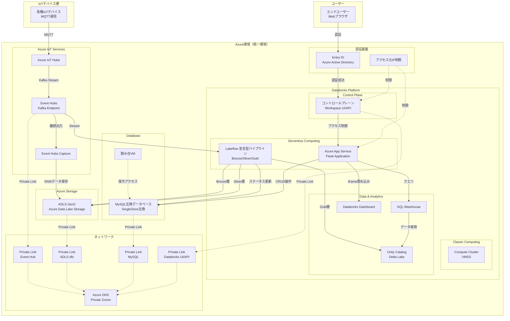
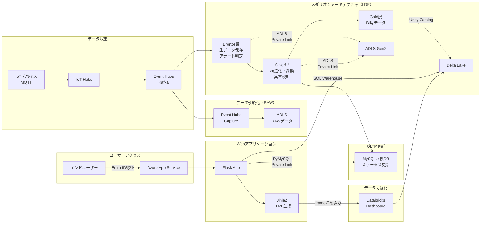

# システムアーキテクチャ概要

## 概要

Databricks IoTシステムは、Azure環境上に構築された統合IoTデータプラットフォームです。Azure IoT ServicesとDatabricks Platformを組み合わせ、IoTデバイスからのデータ収集、リアルタイム処理、分析、可視化までを一貫して実現します。

**重要**: Azure IoT Hubsを含むAzure IoTプラットフォームとDatabricks Platformは、**同一のAzure環境内**にデプロイされます。これにより、Private Linkを活用したセキュアな通信、低レイテンシーなデータ連携、統一されたガバナンスを実現しています。

## システム構成図

## 主要コンポーネント

### 1. IoTデバイス層
- **各種IoTセンサー・デバイス**: MQTTプロトコルによるデータ送信
- **通信プロトコル**: MQTT over TLS 1.2+
- **デバイス規模**: 最大100,000デバイス対応

### 2. Azure IoT Services（Azure環境内）
- **Azure IoT Hubs**:
  - IoTデバイスとの双方向通信ハブ
  - デバイス認証・管理
  - MQTT → REST変換
- **Event Hubs**:
  - Kafkaエンドポイント提供
  - Databricks LDPへのストリーム配信
  - **Event Hubs Capture**: RAWデータをADLSに継続出力（長期保存・障害復旧用）
- **Private Link**: Event Hubs用Private Linkによるセキュア通信

### 3. Databricks Platform（Azure環境内、Databricks-managed network）
- **コントロールプレーン**:
  - Workspace API
  - OAuth トークン フェデレーションによるユーザー認証
  - アクセス元IP制限
- **サーバレスコンピューティング**:
  - **Lakeflow 宣言型パイプライン (LDP)**: Python/SQLによるストリーム処理
- **クラシックコンピューティング**:
  - **Compute Cluster (VMSS)**: 顧客VNet内デプロイ、バッチ処理・対話型分析
- **データ & 分析**:
  - **Unity Catalog**: Delta Lakeベースのデータカタログ、データガバナンス
  - **SQL Warehouse**: SQLクエリ実行エンジン
  - **Databricks Dashboard**: データ可視化・BIダッシュボード
- **Private Link**: ADLS (dfs) / MySQL / Databricks UI APIへのPrivate Link接続

### 4. Azure Storage（Azure環境内）
- **ADLS Gen2 (Azure Data Lake Storage)**:
  - Unity Catalogのストレージバックエンド
  - Event Hubs CaptureによるRAWデータ保存
  - Bronze/Silver層のデータ保存
  - **Private Link**: dfsエンドポイント用Private Link

### 5. アプリケーション層
- **Flask Webアプリケーション**:
  - Python 3.11ベース
  - Jinja2テンプレート（サーバーサイドレンダリング）
  - REST API提供
  - Azure App Serviceでホスティング
- **ユーザー識別**: リバースプロキシヘッダからのユーザー情報取得
- **データアクセス**:
  - Unity Catalog (SQL Warehouse経由) - IoTデータ、分析データ
  - MySQL互換データベース - マスタデータ、デバイスステータス

### 6. データ層
- **Unity Catalog (Delta Lake)**:
  - メダリオンアーキテクチャ（Bronze/Silver/Gold）
  - センサーデータの大量保存
  - 分析用データマート
  - ストレージバックエンド: ADLS Gen2
- **MySQL互換データベース (SingleStore互換)**:
  - マスタデータ（デバイス、ユーザー、アラート設定）
  - 最新デバイスステータス
  - OLTP用途
  - **Private Link**: MySQL用Private Link
  - **踏み台VM**: プライベートネットワーク内のDB保守アクセス

### 7. ネットワーク & セキュリティ（Azure環境内）
- **Private Link**:
  - Event Hub用Private Link
  - ADLS (dfs) 用Private Link
  - MySQL用Private Link
  - Databricks UI/API用Private Link
- **Azure DNS**: Private Zones（Private Link名前解決）
- **認証基盤**:
  - **認証共通モジュール**: Azure/AWS/オンプレミス環境に対応
  - **Databricks接続**: OAuth トークン フェデレーションによるユーザー単位認証とデータスコープ制御
  - **アクセス元IP制限**: Databricksワークスペース、公開フロントへのIP制限
- **リバースプロキシ**: 認証成功後、ユーザー識別子・アクセストークンをリクエストヘッダに付与

## 技術スタック

### プラットフォーム & インフラストラクチャ
- **クラウド**: Microsoft Azure（統一環境）
- **Databricks**: Premium ライセンス
- **IoT**: Azure IoT Hubs、Event Hubs
- **ストレージ**: ADLS Gen2、Delta Lake
- **データベース**: MySQL互換（SingleStore互換）
- **ネットワーク**: Private Link、Azure DNS
- **認証**: Entra ID (Azure AD)

### データ処理
- **ストリーム処理**: Lakeflow 宣言型パイプライン (LDP) - Python/SQL
- **バッチ処理**: Databricks Compute Cluster
- **データアーキテクチャ**: メダリオンアーキテクチャ（Bronze/Silver/Gold）
- **データカタログ**: Unity Catalog
- **クエリエンジン**: SQL Warehouse

### アプリケーション開発
- **プログラミング言語**: Python 3.11+
- **Webフレームワーク**: Flask
- **テンプレートエンジン**: Jinja2
- **データアクセス**:
  - @databricks/sql (SQL Warehouse接続)
  - PyMySQL (MySQL互換DB接続)
- **実行環境**: Azure App Service (App Compute)

### 通信プロトコル
- **IoTデバイス通信**: MQTT over TLS
- **ストリーミング**: Kafka (Event Hubs)
- **API**: REST (Flask)
- **認証**: OAuth 2.0 (Entra ID)

## データフロー全体図

## 関連ドキュメント

- [フロントエンドアーキテクチャ](./frontend.md)
- [バックエンドアーキテクチャ](./backend.md)
- [インフラストラクチャ設計](./infrastructure.md)
- [データモデル](./data-models/)
- [アーキテクチャ決定記録 (ADR)](./decisions/)

---

## 編集履歴

| 日付       | バージョン | 編集者 | 変更内容                                                                                                    |
| ---------- | ---------- | ------ | ----------------------------------------------------------------------------------------------------------- |
| 2025-11-26 | 1.0        | Claude | 初版作成: Azure環境統合（Azure IoT + Databricks同一環境）の明確化、システム全体構成図とデータフロー図の追加 |
| 2025-11-26 | 1.1        | Claude | 環境構成セクション削除: 環境構成詳細はinfrastructure.mdに集約（overview.mdはシステム全体像に集中）          |
