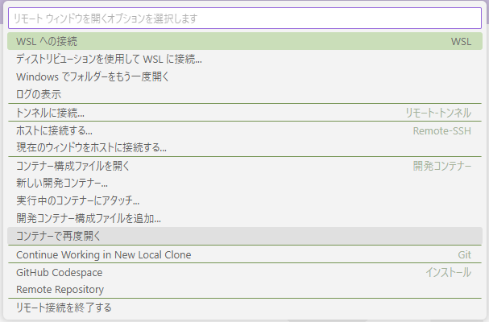

# Locust

## 事前準備

* __MQTT__ ... MQTT サーバに対象のアダプタを追加します。

* __IoTCore__ ... IoTCore に対象のアダプタを追加して、証明書をダウンロードします。  
証明書: `key/アダプタ名-certificate.pem.crt`, 秘密鍵: `key/アダプタ名-private.pem.key`  
~~詳しい手順は [adapter/README.md](adapter/README.md) を参照。~~

## アダプタ通信 開始方法 (ローカルで起動する場合)

マスター → ワーカーの順番に起動します。

### コンテナ起動

DevContainer を起動します。

1. WSL 環境でリポジトリをクローンします。

2. VSCode でクローンしたフォルダを開きます。

3. VSCode の左下にある "WSL: ..." を押下して、メニューから「コンテナーで再度開く」を選択します。




4. コンテナが起動するまでしばらく待ち、VSCode の左下に "開発コンテナー: Python 3" が表示されることを確認します。


### adapter_list.csv を編集

`adapter_list.csv` ファイルに、対象のアダプタを追加する。

マスター・ワーカー構成の場合、ファイルは `locust/master/adpter_list.csv` を修正する。

#### MQTT サーバ向け

アダプタ名、パスワード、MQTT サーバの URL を登録します。

設定例:

```csv:adapter_list.csv
Thing,Password,Host,ConnectionType
"AD09442001","password","mqtt1.example.jp","ActiveMQ"
```

#### IoTCore 向け

アダプタ名、IoTCore の URL を登録します。
パスワードは使わないため空欄です。

設定例:

```csv:adapter_list.csv
Thing,Password,Host,ConnectionType
"AD12512000","","example.iot.ap-northeast-1.amazonaws.com","IoTCore"
```

ダウンロードした証明書、秘密鍵ファイルを `locust/worker/key/` にコピーします。

### Locust マスター起動

ターミナルを二つ用意し、マスター・ワーカー構成で開始する。

```bash
cd locust/master

locust --csv-full-history --master --tags longrun -u 1 -r 1 -t 60 --headless --expect-workers 1
```

* `-u 1` ... アダプタが 1 台
* `-r 1` ... (アダプタが複数の場合) 1 秒間に初期化されるアダプタの台数
* `-t 60` ... 60秒間動作してから停止
* `--headless` ... WWW コンソールを利用しない
* `--expect-workers 1` ... ワーカーの台数

#### モードの切り替え

1. メンテナンス明け

メンテナンス明けの通信をエミュレートするには、タグ `maintenance` で起動します。

```bash
locust --csv-full-history --master --tags maintenance
```

2. ロングラン

ロングランテストの通信をエミュレートするには、タグ `longrun` で起動します。

```bash
locust --csv-full-history --master --tags longrun
```

### Locust ワーカー起動

ワーカーを起動する場合は、マスターのアドレスを指定してください。
ローカルで起動する場合は `127.0.0.1` を指定します。

```bash
cd locust/worker
locust --worker --master-host=127.0.0.1
```

### 参考: 一台構成で開始する。

マスター・ワーカー構成を使わずに、単体で起動することもできます。

```bash
# IoTCore 向けの機種 (K101) を指定する
locust --csv-full-history -u 1 -r 1 -t 60 --headless
```

### 参考: WWW コンソールを開く

`--headless` を指定しないことで、WWW コンソールを利用することができます。

http://127.0.0.1:8080 にアクセスします。

下記のパラメータを調整して、【Start swarming】ボタンを押下すると負荷テストが始まります。

* Number of users (peak concurrency): 最大ユーザー数
* Spawn rate (users started/second) : 1秒ごとに増えるユーザー数

## 画面 API 開始方法

アダプタの起動と基本は同じですが、下記の違いがあります。

* `--tags` で対象の API を絞り込むことができます。
* `adapter_list.csv` の指定がありません。

```bash
cd locust/dspif
locust --csv-full-history -u 1 -r 1 -t 60 --headless
```

### API の切り替え

負荷試験で応答に時間がかかる API (high-load) とそうでない API (low-load) を切り替えることができます。

1. 低負荷 API

負荷が低くて成功率が高い API を呼び出します。

```bash
cd locust/dspif
locust --csv-full-history -u 1 -r 1 -t 60 --headless --tags low-load
```

2. 高負荷 API

負荷が高い API を呼び出します。
高確率で呼出しが失敗する場合があります。 (2025年3月現在)

```bash
cd locust/dspif
locust --csv-full-history -u 1 -r 1 -t 60 --headless --tags high-load
```
